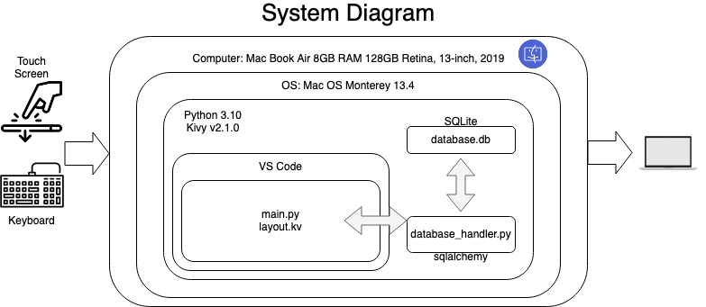
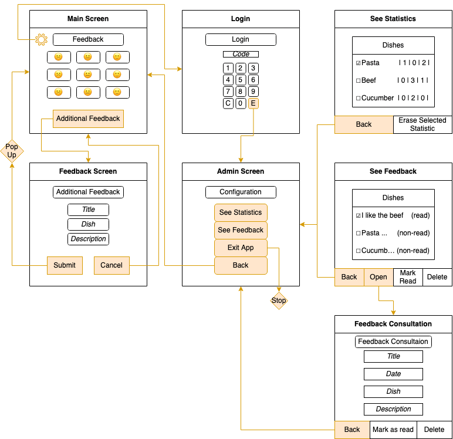
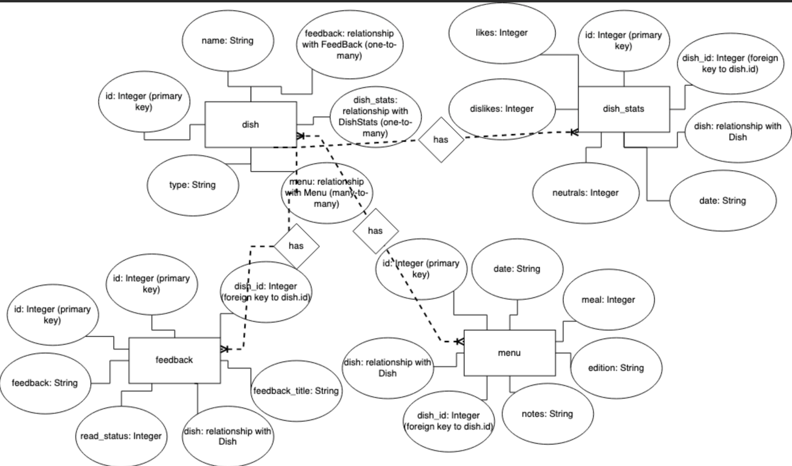
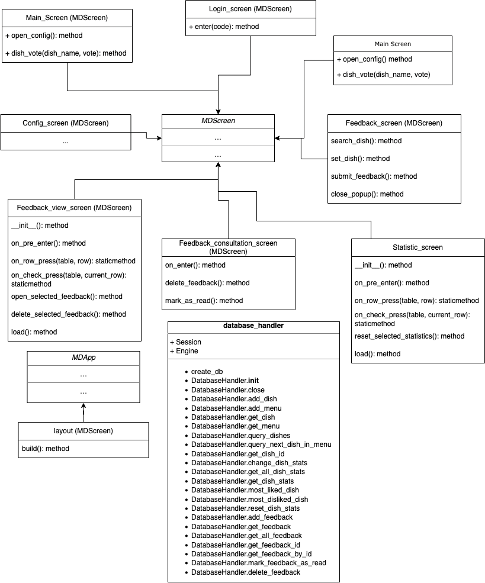
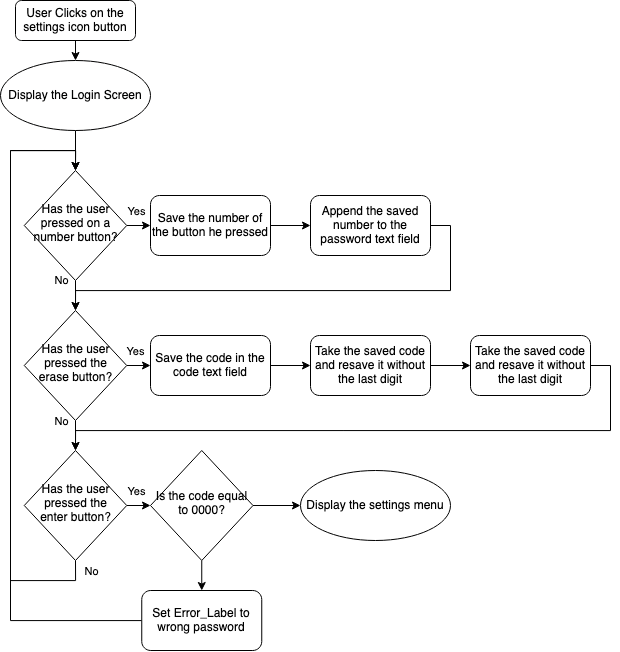
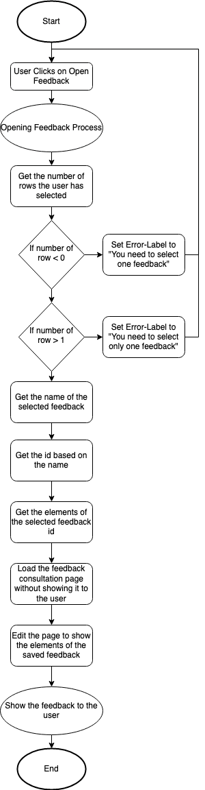
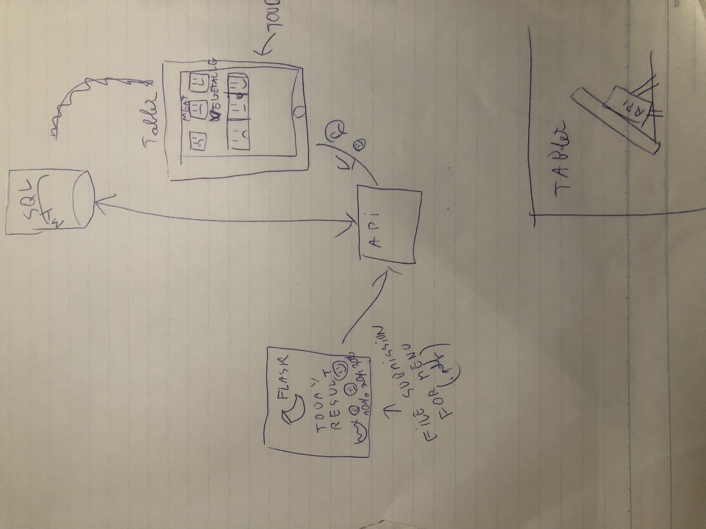
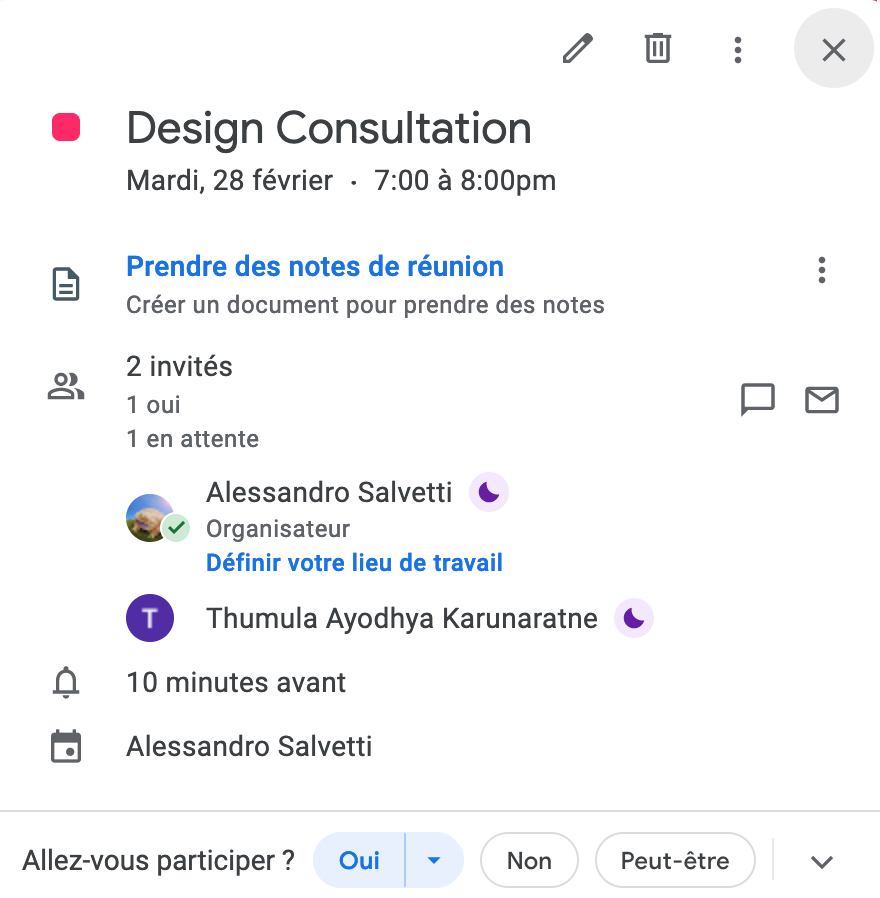
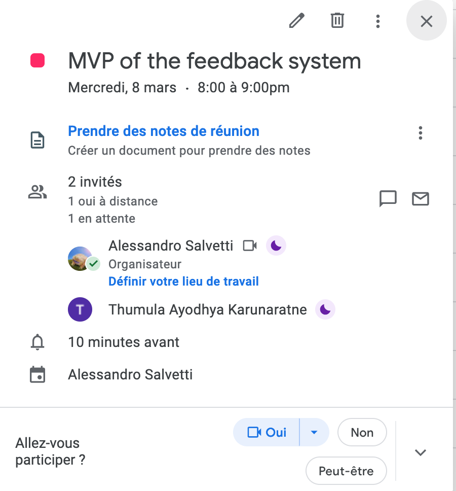

# Unit 3 Project: CK Feedback Software


<i> A pixel art of a person cooking some pancakes in a 3d cubic kitchen </i>

# Criteria A: Planning

## Problem definition

Cezar Kitchen is a high school cafeteria that serve students and staff in Internationnal school in Japan. The cafeteria is managed by a Japanese Chef and has a student representative named that is also part of the school, the student is also my client. Until recently there was a notebook near the exit where you could write feedback about the lunch that you just eat, but because people where using it just to spam two things (karage and apple crumble), therefore the notebook was removed. One day my client had the idea to create a device that could take feedback at the exit like the ones after the security check in airports. Because the number of dishes could change it was opted for a numerical feedback system. Also to have a more specific feedback, the device should have a screen where the user could write a comment. The device should also have a login system for the management to see the feedback and the comments. 

## Succes Criteria

1. The device should be user-friendly and easy to understand for students and staff of the Internationnal school in Japan.
2. The device should be able to capture both numerical statistics and feedback.
3. The device should have a login system should prevent unauthorized students/staff from accessing, editing, deleting feedback and statistics.
4. The system should be able to store the feedback and comments in a database for future reference and analysis.
5. The feedback device should be stable and reliable, with minimal downtime or technical issues.
6. The GUI design should be aesthetically pleasing (Color Scheme, Icons, Backgrounds, etc.)

## Design Statement 

Looking at the clients requirements the best solution for this feedback system would be a tablet with a set of buttons to allow the user to add a quick one-click feedback and a second button to allows to a more dish specific feedback. Because Dariosan usually dosen't uses his computer oftenly it would be better to make the feedback availeble for review dirrectly on the feedback screen.

For the back end management we decided to use python because it is a language that I am familiar with and it is easy to use, and because this is a small project performance is not a big issue.
For the GUI design we decided that using kivy would be the best option because I already had some experience with it and it would be easy to implement with the database because it a framework that uses python. Even if flutter would be a better option at every aspect [^1], it would be too much work to learn it in such a short time for this kind of short project. I used the add-on library KivyMD to make it easier to implement and edit.


# Criteria B: Design

## System Diagram


<i>Fig. 1</i> **System Diagram**

Here is the system diagram of the interface. This system diagram and the others were made with draw.io [^4]

## Wireframe


<i>Fig. 2</i> **Wireframe**

## Er Diagram


<i>Fig. 3</i> **ER Diagram**

## UML Diagram


<i>Fig. 4</i> **UML Diagram**

## Flow Diagram

### Add Feedback Flow Diagram


<i>Fig. 5</i> **Add Feedback Flow Diagram**

This flowchart shows the process of adding a feedback to the database. The user will first type the title of the feedback. He will also have the option to add a specific dish, by entering the name of the dish and a function will show similar dished to the one he entered (avoid the same dishes with the same name). The user will then add the feedback and once he will click on the submit button the feedback will be added to the database, showing a pop up to show succes.

### Login Flow Diagram


<i>Fig. 6</i> **Login Flow Diagram**

Once the user will click on the setting icon he will be redirected to the login screen. The user will enter the code on the keypad with the touch screen or enter it manually with the help of a keyboard. Once he presses enter the program wil check if the entered password is correct, if not it will show an error message, if correct it will redirect the user to the settings screen.

### Open Feedback Flow Diagram


<i>Fig. 7</i> **Open Feedback Flow Diagram**

Once the user will click on the feedback icon he will be redirected to the feedback screen. The user will be able to see all the feedbacks that are in the database. He will also be able to open a feedback by checking one and clicking on the button "Open Feedback". If the selected feedback is one and only one the user will be redirected to the feedback page, if not he will be shown an error message. Before redirecting the program will pull the necessary data from the database and set it the the screen without showing it to the user.

## Test Plan

Here is my test plan

| Type                | Description                | Process                                                      | Anticipated Outcome                                          |
| ------------------- | -------------------------- | ------------------------------------------------------------ | ------------------------------------------------------------ |
| Unit Testing        | Adding Numerical Feedback  | 1) Run main app<br />2) Click on *happy* on the vegetable part | If the code would work proprely, when we would run the query <u>SELECT * FROM dish_stats</u> whe sould get our vegetable upvote |
| Unit Testing        | Adding Written Feedback    | 1) Run main app<br />2) Click on *additional feedback*<br />3) Add title, dish, and description<br />4) Click *Submit* | Try <u>SELECT * FROM  feedback</u> and you should see the feedback you just added |
| Unit Testing        | Adding Written Feedback    | 1) Run main app<br />2) Click on the *cog* on the top left of the screen<br />3) Enter 0000 in the *text box*<br />4) Press Enter<br />3) Enter 1234 in the *text box*<br />4) Press *Enter*<br /> | First time you will try to login you will get an incorect password alert, second time it will successfully login and you will apear in the main screen. |
| Integration Testing | Seeing Statistics          | 1) Run main app<br />2) Click on happy on the vegetable part<br />2) Click on the cog on the top left of the screen<br />3) Enter 1234 in the *text box*<br />4) Press *Enter*<br /><br />5) Press *See Statistics* | This will add a statistic on the vegetable and you will then travel to the see statistic page were you are supposed to see the smiley you just added. |
| Integration Testing | Deleting Statistics        | 1) Run main app<br />2) Click on happy on the vegetable part<br />2) Click on the cog on the top left of the screen<br />3) Enter 1234 in the *text box*<br />4) Press *Enter*<br /><br />5) Press *See Statistics*<br />6) Select the vegetable<br />7) Press *Delete Statistics* | This will add a statistic on the vegetable and you will then travel to the see statistic page were you are supposed to see the smiley you just added. You will then remove the selected statistic and you will see it disappear. |
| Integration Testing | Seeing Feedback            | 1) Run main app<br />2) Click on *additional feedback*<br />3) Add title, dish, and description<br />4) Click *Submit*<br />5) Click on the cog on the top left of the screen<br />6) Enter 1234 in the *text box*<br />7) Press *Enter*<br /><br />8) Press *See Feedback*<br /> | This will add a feedback on the dish you selected and you will then travel to the see feedback page were you are supposed to see the feedback you just added. |
| Integration Testing | Reading/Deleting Feedback  | 1) Run main app<br />2) Click on *additional feedback*<br />3) Add title, dish, and description<br />4) Click *Submit*<br />5) Click on the cog on the top left of the screen<br />6) Enter 1234 in the *text box*<br />7) Press *Enter*<br /><br />8) Press *See Feedback*<br /><br />9) Press *read feedback*<br />10) Select 2 feedbacks<br />11) Press *read feedback*<br />12) Unselect one of the feedbacks<br />13) Press *read feedback*<br />14) Press *delete feedback* | This will add a feedback on the dish you selected and you will then travel to the see feedback page were you are supposed to see the feedback you just added.<br />You will then get an alert to select at least 1 feedback and then another one telling you to select only one feedback. They you will see the status change to read and then the feedback will disappear. |
| Integration Testing | Open Feedback Consultation | 1) Run main app<br />2) Click on *additional feedback*<br />3) Add title, dish, and description<br />4) Click *Submit*<br />5) Click on the cog on the top left of the screen<br />6) Enter 1234 in the *text box*<br />7) Press *Enter*<br /><br />8) Press *See Feedback*<br /><br />9) Select 1 feedbacks<br /><br />10) Press *Open feedback* | This will add a feedback on the dish you selected and you will then travel to the see feedback page were you are supposed to see the feedback you just added. Then you will see a page open with the individual title, dish, description open to the appropriate selected feedback. |
| Integration Testing | Open Feedback Consultation | 1) Run main app<br />2) Click on *additional feedback*<br />3) Add title, dish, and description<br />4) Click *Submit*<br />5) Click on the cog on the top left of the screen<br />6) Enter 1234 in the *text box*<br />7) Press *Enter*<br /><br />8) Press *See Feedback*<br /><br />9) Select 1 feedbacks<br /><br />10) Press *Open feedback*<br />11) Press *read feedback*<br />12) Press *delete feedback* | This will add a feedback on the dish you selected and you will then travel to the see feedback page were you are supposed to see the feedback you just added. Then you will see a page open with the individual title, dish, description open to the appropriate selected feedback.<br />They you will see the status change to read and then the feedback will disappear. |
| Code Review         | Reviewing Code             | Making sure all the unused / testing code is removed, variables are named correctly and there is coments on the critical parts of the program. | Easy to understand, debug and recycle code                   |


## Record of task

PS: Don't look at my commit history, pushes were not made at the time I made the actual modifications

| Task No | Planned Action                                          | Planned Outcome                                              | Time estimate            | Target completion date | Criterion |
| ------- | ------------------------------------------------------- | ------------------------------------------------------------ | ------------------------ | ---------------------- | --------- |
| 1       | Planning: First Meeting with client                     | Start collecting the context of the problem                  | 6 min                    | Feb 7                  | A         |
| 2       | Planning: Defining problem and proposed solution        | Start on refining client's requirements and tools needed     | 60 min                   | Feb 20                 | A         |
| 3       | Designing: Codebase schemas                             | Creating the codebase schemas for our database               | 30 min                   | Feb 22                 | B         |
| 4       | Planning: First Quick Chat                              | Quick Chat with thumula to show him the created  database shema | 10 min                   | Feb 23                 | A         |
| 5       | Planning: Second Meeting with client                    | Defining succes criterias                                    | 15 min                   | Feb 24                 | A         |
| 6       | Designing: Wireframe of the program                     | The mains functions wireframe diagrams                       | 2 hours                  | Feb 24                 | B         |
| 7       | Planning: Second Quick Chat                             | Checking for the approval of the wireframes by Thumula       | 10 min                   | Feb 25                 | A         |
| 8       | Coding: the database_handler                            | Coding the handler of the schemas with alchemy               | 2 hours                  | Feb 27                 | C         |
| 9       | Coding: Screen Manager and .py                          | Coding the roots of my program                               | 30 min                   | Feb 27                 | C         |
| 10      | Coding: Main Screen layout with vote system             | Just the layout, no backend                                  | 15 min                   | Feb 27            | C         |
| 11      | Coding: Backed of main screen                           | Backed of the previous task                                  | 20 min                   | Feb 37            | C         |
| 12      | Testing: Main screen vote system                        | Just testing if it works                                     | 5 min                    | March 1                | D         |
| 13      | Coding: Additional Feedback layout and the backed of it | The screen where you can write the feedback with the dishes  | 1 hour                   | March 1                | C         |
| 14      | Testing: Additional Feedback System                     | Previous step testing                                        | 5 min                    | March 1                | D         |
| 15      | Planning: Third quick chat                              | Showing Thumula the progress of the app                      | 7 min                    | March 1                | A         |
| 16      | Coding: Login Screen                                    | The names gives it all                      | 30 min                   | March 2                | C         |
| 17      | Coding: Config Screen                                   | Like an admin screen                                         | 30 min                   | March 2                | C         |
| 18      | Testing: Previous two tasks test                        | I NEED TO SLEEP                                              | 5 min                    | March 2                | D         |
| 19      | Planning: Forth quick chat                              | Showing Thumula the progress of the app                      | 7 min                    | March 2                | A         |
| 20      | Coding: More handler functions                          | Yep, you guest it, moar functions                            | 10 min                   | March 3                | C         |
| 21      | Coding: Statistic view                                  | Showing the statistics got in the main screen                | 2 hours                  | March 3                | C         |
| 22      | Testing: Testing Statistic view                         | It worked                                                    | 5 min                    | March 3                | D         |
| 23      | Coding: The feedback view screen                        | Same as statistiks but with moar buttons                     | 1 hour                   | March 4                | C         |
| 24      | Coding: The feedback consultation screen                | Like the feedback input but without input                    | 40 min                   | March 5                | C         |
| 25      | Testing: Testing last two steps                         | Again it worked                                              | 5 min                    | March 6                | D         |
| 26      | Planning: Fifth quick chat                              | Showing Thumula the progress of the app                      | 7 min                    | March 7                | A         |
| 27      | Start of documentation                                  | Here we go                                                   | 1 hours                  | March 7                | B         |
| 28      | Criteria B<br />Criteria C<br />Criteria D              | Ok let me explain, I had a math test and the dog ate my repo<br />You proposed the gample and human brain like gable, next time, no gable (or at least get lucky) | 6 hours less to my sleep | March 10               | B-C-D     |


# Criteria C: Development

## Existing Tools
| Software/Development Tools | Coding Structure Tools       | Libraries  |
|----------------------------|------------------------------|------------|
| Visual Studio Code         | OOP Structures(Classes)      | Kivymd.app |
| Python                     | SQL requests                 | Passlib    |
| SQLite                     | Databases                    | sqlalchemy |
| KivyMD                     | Encryption                   | kivymd.uix |
| ChatGPT / GPT-3            | For Loops                    | kivy.logger|
| Github Copilot             | If-then-else statements      |            |
| draw.io                    | ORM(Object Relation Mapping) |            |

## List of techniques used

1. Objected Oriented Programming (OOP)
2. Object Relational Mapping (ORM) with SQLAlchemy
3. KivyMD
4. SQLite (for testing)
6. For loops
7. If statements
8. Functions
9. Using classes as libraries

## Computational Thinking

### Decomposition of the query dish problem

    Problem: Display a list of dishes based on user input.
    
    Inputs:
    -"dishes": a string entered by the user.
    
    Outputs:
    - A list of dishes that match the user's input.
    
    Algorithm:
    a. Clear any existing dish suggestions.
    b. If the user input is empty, return.
    c. Log the user input.
    d. Create a database handler object.
    e. Query the database for dishes that match the user input.
    f. If no dishes are found, log a warning and return.
    g. For each dish found, log its name and add it to the dish_suggestion BoxLayout as a button.
    h. Close the database connection.
By breaking down the code into these parts, it becomes easier to understand the purpose and functionality of each piece. This can also make it easier to recycle in another project.


### Pattern recognition, generalization and abstraction of the tables
When you look at the code from the statistics visualisation and the entered the feedback, the code looks very similar. Why? Becuase it's nearly the same thing, i just needed to change the load function and the buttons to edit the rows and voila.

This is why recognizing similarities, generalizing and abstracting is so important. It allows you to reuse code and saves you a ton of time.


## Development of User Interface Using KivyMD

### Screen Manager

```.kv
ScreenManager:
    id:src_manager

    Main_screen:
        name: 'main_screen'

    Feedback_screen:
        name: 'feedback_screen'

    Login_screen:
        name: 'login_screen'

    Config_screen:
        name: 'config_screen'
```
The client needed an interface capable of supporting multiple screens as everything would not fit one screen. The screen manager allows the user to switch between screens. The screens are defined in the .kv file and are called by the name attribute. The screen manager is defined in the main.py file.

Each screen is defined in the .kv in the following way:
```.kv
<Screen_name>:
    name: 'screen_name'
```
The screen manager is then able to call the screen by the name attribute. Also each screen will have his own class back in the main python file.

### Common Layouts
```.kv
<Main_Screen>:
    name: 'main_screen'
    FitImage:
        source: "assets/program/background.jpg"
        # change the size of the image
        size_hint: 1, 1
        # change the position of the image
        pos_hint: {'center_x': 0.5, 'center_y': 0.5}

    MDCard:
            size_hint: 0.85, 0.85
            pos_hint: {'center_x': 0.5, 'center_y': 0.5}
            orientation: 'vertical'
            padding: 10
            #make the card a bit transparent
            # opacity: 0.3 use alpha instead
            md_bg_color: 1, 1, 1, 0.3
```
The client wanted a simple and clean interface. Cards allow to create clean usable boxes to add content to. Also they allow to control the how items are arranged inside the card.
For this program I chose to set the opacity of the card to 0.3. This allows to see the background image but not to much to distract the user or to burn his eyes. 

FitImage is a custom widget that allows to set the size of the image to the size of the screen. This allows to have a background image that will always fit the screen. I chose this image [^2] as a background because it's cute and it's not distracting.

### MDBoxLayout

```.kv
MDBoxLayout:
    orientation: "vertical"
    
    padding: "8dp"
    pos_hint: {'center_x': 0.5, 'center_y': 0.5}
```
The MDBoxLayout is like a card but without the background. It allows to create a box that will contain other widgets. The padding attribute allows to set the distance between the widgets inside the box. The pos_hint attribute allows to set the position of the box. In this case the box will be centered on the screen.

### MDTextField

```.kv
MDTextField:
    id: feedback_title
    hint_text: "Title"
    helper_text: "Enter the title of the feedback"
    helper_text_mode: "on_focus"
    icon_right: "comment-text"
    icon_right_color: app.theme_cls.primary_color
    pos_hint: {'center_x': 0.5, 'center_y': 0.5}
    size_hint_x: None
    width: 300
```
he MDTextField is a box where you can type text. The hint_text tells you what to write in the box when there's no text in it. The helper_text helps give more information about the text field when you focus on it. The icon_right is an icon that will appear on the right side of the text field. The icon_right_color allows to choose the color of the icon. The pos_hint attribute centers the text field on the screen. size_hint_x decides how wide the text field can stretch and width lets you set a specific width in pixels for the text field.

### MDLabel

```.kv
MDLabel:
    text: "Feedback"
    halign: "center"
    theme_text_color: "Primary"
    font_style: "H5"
    pos_hint: {'center_x': 0.5, 'center_y': 0.5}
    size_hint_x: None
    width: 300
```
The MDLabel can show text, and you can change the displayed text, position, color, and font style. You can also set its width either in proportion to other elements or in pixels.

### MDRaisedButton

```.kv
MDRaisedButton:
    text: "Submit"
    pos_hint: {'center_x': 0.5, 'center_y': 0.5}
    on_release: app.submit_feedback()
```
MDRaisedButton is a button that performs an action when pressed. You can choose what the button should do when it's finished by using the on_release attribute. In this example, pressing the button will trigger the submit_feedback() function.

### MDIconButton

```.kv
MDIconButton:
    icon: "arrow-left"
    pos_hint: {'center_x': 0.5, 'center_y': 0.5}
    on_release: app.go_back()
```
Same as raised button but with an icon instead of text.

### Popup

```.py
    content = BoxLayout(orientation='vertical')
    content.add_widget(Label(text=message))
    button = Button(text="Back to main screen")
    button.bind(on_release=lambda *args: self.close_popup(popup))
    content.add_widget(button)
    popup = Popup(title='Feedback', content=content, size_hint=(None, None), size=(400, 400))
    popup.open()

def close_popup(self, popup):
    popup.dismiss()
    self.manager.current = 'main_screen'
```
Exceptionally, the popup is written in the python part because it doesn't have to appear on the screen at the start.
This code creates a feedback popup with a message and a button that takes the user back to the main screen. The popup is defined using a BoxLayout widget with a label and button added. Then a Popup widget is created and opened. When the button is pressed, it triggers the function close_popup() which dismisses the popup and changes the current screen to the main screen.


# Criteria D: Functionality
## Video Showcasing the Functionality of the Application
Video link: 
https://drive.google.com/drive/folders/19rHUjq1sbOcLzrTqbqcg2wqcQPS8N_6l?usp=sharing

## Evidence of Testing

### Database Integrity Testing
This pytest is a fast test you can run before the running of the program to make a quick check of the integrity of the database. It is not a complete test but it is a good start to make sure that the database is working properly.
```.py
import pytest

from database_handler import DatabaseHandler


def test_create_db():
    # Test that create_db() function returns None
    assert create_db() is None


def test_add_dish():
    # Create a DatabaseHandler instance
    db_handler = DatabaseHandler()

    # Add a dish and check if it returns None
    assert db_handler.add_dish('Spaghetti', 'Italian', 'Pasta, Tomato sauce, Meat') is None

    # Query the dishes with input search string 'hett'
    dishes = db_handler.query_dishes('hett')
    
    # Assert that the recently added dish 'Spaghetti' is in the result list 
    assert any(dish.name == 'Spaghetti' for dish in dishes)

    # Close the session
    db_handler.close()
```
*Fast Main Test (if you was to test the main things)*

### All Database Handler Functions Testing
This pytest is a more complete test that tests all the functions of the database handler. It is a bit slower than the previous one but it is useful to check if the modifications you did to the handler are working properly.

Importing the Handler and the libraries
```.py
from datetime import date, datetime
from database_handler import DatabaseHandler
import pytest
```

Nice trick that i forgot to implement (avoiding to leave the database open) and to erase it content for every test (so be careful)
```.py
def db():
    engine = create_engine('sqlite:///test.db')
    Session = sessionmaker(bind=engine)
    session = Session()
    session.query(DishStats).delete()
    session.query(Menu).delete()
    session.query(FeedBack).delete()
    session.query(Dish).delete()
    session.commit()
    yield session
    session.close()
```

Testing some of the other function with the fixture trick
```.py
def test_add_dish(db):
    handler = DatabaseHandler()
    handler.add_dish('Spaghetti Bolognese', 'Pasta', 'Spaghetti, tomato sauce, ground beef, onion, garlic')
    dish = db.query(Dish).filter_by(name='Spaghetti Bolognese').first()
    assert dish is not None
    assert dish.type == 'Pasta'
    assert dish.ingredients == 'Spaghetti, tomato sauce, ground beef, onion, garlic'
    db.query(DishStats).delete()
    db.query(Dish).delete()
    db.commit()
    handler.close()

def test_add_menu(db):
    handler = DatabaseHandler()
    handler.add_dish('Spaghetti Bolognese', 'Pasta', 'Spaghetti, tomato sauce, ground beef, onion, garlic')
    dish = db.query(Dish).filter_by(name='Spaghetti Bolognese').first()
    handler.add_menu(datetime.now().date(), 'Lunch', 'This is a note', dish.id)
    menu = db.query(Menu).filter_by(date=datetime.now().date(), meal='Lunch').first()
    assert menu is not None
    assert menu.notes == 'This is a note'
    db.query(DishStats).delete()
    db.query(Menu).delete()
    db.query(Dish).delete()
    db.commit()
    handler.close()

def test_get_dish(db):
    handler = DatabaseHandler()
    handler.add_dish('Spaghetti Bolognese', 'Pasta', 'Spaghetti, tomato sauce, ground beef, onion, garlic')
    dish = db.query(Dish).filter_by(name='Spaghetti Bolognese').first()
    dish_from_handler = handler.get_dish(dish.id)
    assert dish_from_handler is not None
    assert dish_from_handler.name == 'Spaghetti Bolognese'
    db.query(DishStats).delete()
    db.query(Dish).delete()
    db.commit()
    handler.close()

def test_get_menu(db):
    handler = DatabaseHandler()
    handler.add_dish('Spaghetti Bolognese', 'Pasta', 'Spaghetti, tomato sauce, ground beef, onion, garlic')
    dish = db.query(Dish).filter_by(name='Spaghetti Bolognese').first()
    handler.add_menu(datetime.now().date(), 'Lunch', 'This is a note', dish.id)
    menu = db.query(Menu).filter_by(date=datetime.now().date(), meal='Lunch').first()
    menu_from_handler = handler.get_menu(datetime.now().date(), 'Lunch')
    assert menu_from_handler is not None
    assert menu_from_handler.notes == 'This is a note'
    db.query(DishStats).delete()
    db.query(Menu).delete()
    db.query(Dish).delete()
    db.commit()
    handler.close()
```


# Appendix

## Evidence of Consultation

### First consultation with client and definition of project scope


Very old design and project, please dont critisize me.

### Client approval of proposed success critereas and review of the design



Here Thumula approver my succes criteria and the design of the app.


### Client's review of the application during development process


Also called MVP (Minimum Viable Product) testing.
<i>
MVP stands for Minimum Viable Product. It is a strategy in product development that focuses on the creation of a product with the minimum features necessary to satisfy early customers and gather feedback for future development.
ChatGPT™[^3]
</i>

As you can see the definition is pretty good so that why i included it. After the meeting just some small changes had been requested like more icons and replacing the ascii emojis with real emojis.

### Client's review of final product
The final review happened on the 7th of March and the client seemed to be fully happy about the product.

We are probably going to do a test run in the next weeks and later implement the web part in unit-4.

## Citations

RSS, https://www.adafruit.com/product/386.
[^1]: Educba. "Kivy vs Flutter" Educba, https://www.educba.com/kivy-vs-flutter/
[^2]: Apple. One of the many safari background images, "Safari Backgrounds" Apple, https://www.apple.com/safari/
[^3]: OpenAI. "GPT-3" OpenAI, https://chat.openai.com/chat (Some part of the documentation, like definitions may but are not limited to being generated from OpenAI ChatGPT™)
[^4]: "draw.io" draw.io, https://draw.io

